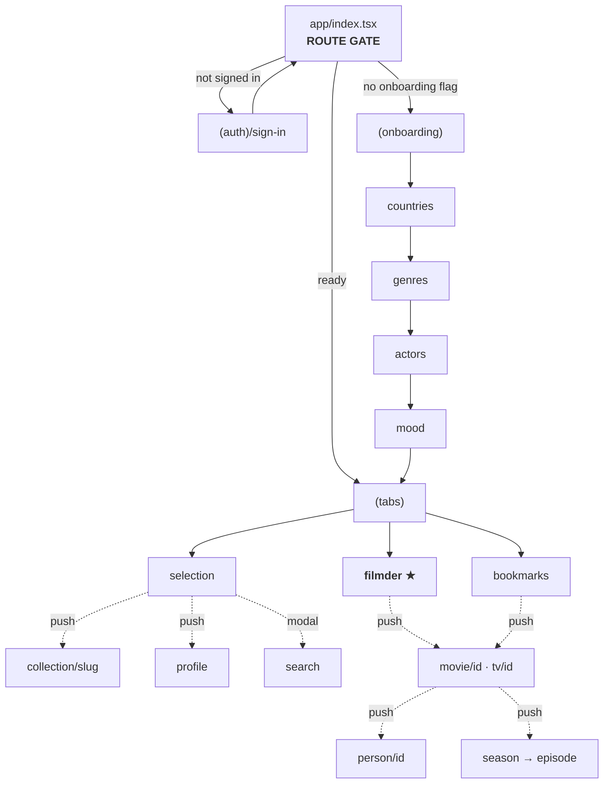
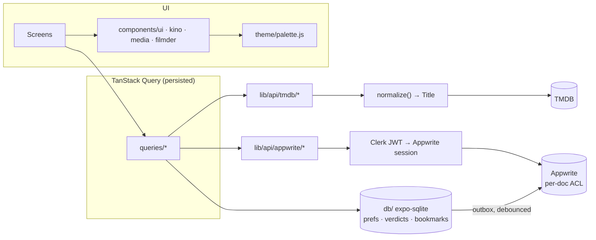

# CineVerse → KinoRoy / Filmder — Implementation Roadmap

## Context

`cine-verse` is a working Expo/React Native movie browser: Clerk Google auth, TMDB listings,
Appwrite bookmarks, a search-count "trending" hack, and a dark/orange aesthetic built around an
animated WebGL aurora. It is ~2,850 lines across 12 screens and 7 components.

The masterplan is a different product wearing a different skin: **KinoRoy / Filmder Cinema** — a
1930s rubber-hose-cartoon retro cinema app in red / dark-brown / ivory, whose headline feature is
**Filmder**, a Tinder-style swipe deck, fed by a **multi-step onboarding** (liked *and disliked*
countries, genres, actors) and a **mood system**. It covers movies *and* TV series, with
seasons/episodes, reviews, and actor blocking.

The foundation (Expo SDK 54, expo-router v6, NativeWind 4, TS strict, New Architecture, Clerk,
TanStack Query, Appwrite) is correct and stays. Almost everything above it changes. This roadmap
sequences that transformation so each phase ships something that visibly works.

---

## 0. App map — current vs. new

### 0.1 Screen tree

**Today — 12 screens, 4 tabs, movies only**

```
CineVerse
├─ (auth)/
│   ├─ sign-in ............. Google OAuth via Clerk
│   └─ sign-up ............. ~95% duplicate of sign-in
├─ (tabs)/  [4 visible + 1 hidden]
│   ├─ index ............... Home — trending(4) + popular grid
│   ├─ search .............. TMDB search, 500 ms debounce
│   ├─ upcoming ............ 3 pages, grouped by month
│   ├─ bookmark ............ Appwrite bookmarks
│   └─ profile ............. hidden (href: null), reached via avatar
├─ movies/[id] ............. detail + Watchmode providers
└─ profile-settings/
    ├─ edit-profile ........ works (Clerk user.update)
    ├─ notifications ....... STUB — switches persist nothing
    ├─ privacy ............. STUB — buttons have no onPress
    └─ help ................ STUB — buttons have no onPress
```

**Target — 3 tabs, modals, movies + TV**

```
KinoRoy / Filmder
├─ index ................... ★ ROUTE GATE (auth? onboarding? tabs?)
├─ (auth)/sign-in
├─ (onboarding)/  ★ NEW
│   ├─ countries ........... like + dislike, flag chips, searchable
│   ├─ genres .............. like + dislike, poster tiles, X to remove
│   ├─ actors .............. like + dislike, circular avatars, searchable
│   └─ mood ................ 5-stop slider
├─ (tabs)/  [3]
│   ├─ selection ........... rails home        (was: index)
│   ├─ filmder ............. ★ SWIPE DECK — the headline feature
│   └─ bookmarks ........... library           (was: bookmark)
├─ search   ⌐
├─ filters  ├─ root modals   (search was a tab; filters + mood are new)
├─ mood     ┘
├─ collection/[slug] ....... generic paginated grid from a discover preset
├─ movie/[id] .............. detail v2 — cast, reviews, videos, providers
├─ tv/[id] ................. ★ NEW
│   └─ season/[s]/episode/[e]  ★ NEW
├─ person/[id] ............. ★ NEW
└─ profile/
    ├─ index
    ├─ settings ............ region, adult filter, reset prefs, sign out
    └─ blocked-actors ...... ★ NEW
```

Gone: `sign-up`, `upcoming` (→ a rail), the three stub settings screens.
Moved: `search` (tab → modal), `profile` (tab → pushed stack).



### 0.2 Architecture

**Today — two non-interoperating data layers, no local storage**

```
  Screens (hardcoded colors, 3 grid systems, no design system)
      │
      ├── useFetch ──────────┬──→ TMDB          (no cache, no cancel, races)
      │   (hand-rolled)      └──→ Appwrite      (ANONYMOUS client → world-writable)
      │
      └── React Query ──────────→ Watchmode     (exactly 1 hook in the whole app)

  Local storage: SecureStore (Clerk token only). No offline. Nothing else.
```

**Target — one query layer, one media model, local-first**

```
  Screens ── components/{ui, kino, media, filmder}  ── theme/palette.js
      │                                                      │
      │                                          tailwind.config.js + JS-side
      │
      └── TanStack Query  (persisted to SQLite)
            │
            ├── lib/api/tmdb/*  ──→ normalize() ──→ Title ──→ TMDB
            │                                    (movie | tv, one shape)
            ├── lib/api/appwrite/* ──→ Clerk-JWT session ──→ Appwrite
            │                          (per-document ACLs)
            └── db/ (expo-sqlite) ←── SOURCE OF TRUTH for hot reads
                  kv · prefs · verdicts · bookmarks · watched_episodes · cache
                  └─ outbox (synced=0) ──debounce──→ Appwrite
```



### 0.3 The Filmder pipeline

```
  prefs (SQLite) ──→ paramsFromPrefs() ──→ /discover ──→ pages (20 each)
                          │                                    │
                     with_genres, without_genres,              │
                     with_origin_country, vote_average.gte     │
                     + vote_count.gte, mood profile            │
                                                               ▼
  verdicts   (SQL exclusion set) ─────────────────────────→ filter
  blocked actors ─────────────────────────────────────────→   │
  disliked countries ─────────────────────────────────────→   │
                                                               ▼
                                            deck[]  (only 3 cards mounted)
                                                               │
                    prefetch: w780 backdrops ×5, detail ×2 ────┤
                                                               ▼
                          swipe / thumbs ──→ SQLite (synchronous, synced=0)
                                                               │
                                              refill when <8 left
                                              debounced flush → Appwrite
```

Over-fetching is structural: `/discover` cannot express "exclude these 800 ids", so a page of 20 can
yield 3 survivors after filtering.

### 0.4 Feature inventory

Legend: **KEEP** works, carries over · **CHANGE** exists, needs rework · **NEW** does not exist

| Area | Functionality | Today | Target | Phase |
|---|---|---|---|---|
| **Entry** | Google sign-in (Clerk) | ✅ works | KEEP — delete duplicate sign-up | 4 |
| | Session persistence | ✅ SecureStore | KEEP | — |
| | Route gate (auth/onboarding/tabs) | ❌ gate split across layouts | NEW — single owner, sync flag | 4 |
| | Onboarding: countries like + dislike | ❌ | NEW | 4 |
| | Onboarding: genres like + dislike | ❌ | NEW | 4 |
| | Onboarding: actors like + dislike | ❌ | NEW | 4 |
| | Onboarding: initial mood | ❌ | NEW | 4 |
| **Filmder** | Swipe deck, gesture + fling | ❌ | NEW ★ | 5 |
| | LIKE/NOPE stamps, haptics | ❌ | NEW | 5 |
| | Thumbs buttons (a11y path) | ❌ | NEW | 5 |
| | Reaction tags ("The movie is shit") | ❌ | NEW | 5 |
| | Infinite refill, no repeats ever | ❌ | NEW | 5 |
| | Works fully offline | ❌ | NEW | 5 |
| **Mood** | 5-stop slider | ❌ | NEW | 4 / 6 |
| | Pick by name **and** by image grid | ❌ | NEW | 6 |
| | Mood → discover params | ❌ | NEW | 6 |
| | Mood result screen + category tabs | ❌ | NEW | 6 |
| **Discovery** | Popular / trending home | ⚠️ trending = own search counts, 4 rows, empty on fresh install | CHANGE → `/trending/all/day` | 2 |
| | Search | ⚠️ tab, races, no cancel | CHANGE → modal, `/search/multi` | 4 |
| | Upcoming | ⚠️ own tab | CHANGE → PREMIERES rail + collection screen | 4 / 7 |
| | Rails home (Selection) | ❌ | NEW — rails as data | 7 |
| | Continue Watching | ❌ | NEW — real for series, ribbon for movies | 7 |
| | Filters: genre / director / year / rating | ❌ | NEW | 7 |
| | Generic collection grid + pagination | ❌ (no pagination anywhere) | NEW | 7 |
| **Detail** | Movie detail | ✅ rich | CHANGE — rebuild on retro motifs | 8 |
| | Cast & crew | ❌ | NEW | 8 |
| | Reviews from readers | ❌ | NEW — TMDB `/reviews` | 8 |
| | Videos / trailers ("ON VIDEO") | ❌ | NEW — TMDB `/videos` | 8 |
| | Where to watch | ⚠️ Watchmode, text only, region hardcoded IN | CHANGE → TMDB providers + logos | 2 |
| | Person / actor pages | ❌ | NEW | 8 |
| | Block actor | ❌ | NEW | 8 |
| | ABOUT FILM expand | ❌ | NEW | 8 |
| **TV** | TV types, endpoints | ❌ none at all | NEW — `Title` union from Ph. 2 | 2 / 8 |
| | Seasons strip, episode screens | ❌ | NEW | 8 |
| | Mark episode watched | ❌ | NEW — feeds Continue Watching | 8 |
| **Library** | Bookmarks | ⚠️ network on every read, silently desyncs, world-readable | CHANGE — SQLite-first, ACL'd | 2 |
| **Profile** | View profile, sign out | ✅ works | KEEP | 4 |
| | Edit name | ✅ works | KEEP | 4 |
| | Notifications / privacy / help | ⚠️ 3 stubs, no handlers | DELETE → one real settings screen | 4 |
| | Blocked actors management | ❌ | NEW | 8 |
| **Platform** | Design system, tokens | ❌ 8 colors, 60% bypassed | NEW — palette bridge | 3 |
| | Fonts | ❌ none loaded | NEW — Anton / Inter Tight / Homemade Apple | 3 |
| | Retro motifs (torn, film strip, ticket, polaroid, marquee, grain) | ❌ | NEW | 3 |
| | Caching + offline | ❌ | NEW — persisted query cache + SQLite | 1 / 2 |
| | Request cancellation | ❌ | NEW | 1 |
| | Per-user data privacy | ❌ world-writable | CHANGE — Clerk JWT session + ACLs | 2 |
| | Brand assets, icon, splash | ⚠️ mismatched, white splash flash | CHANGE | 9 |

**Explicitly out of scope for v1:** friend graph, friend reaction avatars, "THEY LOOKED",
real blogger identities. "Reviews from bloggers" ships as TMDB `/videos` relabelled "ON VIDEO".

---

## 1. Audit — current app vs. masterplan

### 1.1 Exists and is worth keeping

| Asset | Verdict |
|---|---|
| Expo SDK 54 / RN 0.81.5 / expo-router v6 / New Arch / TS strict | Keep as-is. Right foundation. |
| NativeWind 4 + Tailwind wiring (`babel.config.js`, `metro.config.js`, `app/global.css`) | Keep. Only the token values change. |
| Clerk auth + `lib/auth-storage.tsx` (SecureStore token cache) | Keep. Delete the duplicated `sign-up.tsx`. |
| `lib/react-query.ts` (untracked) — hoists `queryClient` out of the render tree | Keep. This is a real fix; build on it. |
| Appwrite project + the bookmark concept | Keep the project, secure the access, restructure the collections. |
| `SearchBar.tsx` dual-mode `forwardRef` pattern | Keep the pattern, restyle the surface. |
| 500 ms search debounce | Keep the behaviour, move it into a debounced query key. |
| Month-grouping logic in `(tabs)/upcoming.tsx` | Extract to `lib/format/groupByMonth.ts` before the screen is deleted. |
| `expo-image`, `reanimated`, `gesture-handler`, `expo-haptics` — installed, **zero imports** | Free wins. The whole motion/polish layer needs no new deps. |

### 1.2 Must change

| Area | Problem today | Target |
|---|---|---|
| Data fetching | `services/useFetch.ts` — `useEffect` deps `[]`, no cancellation, no cache, no stale-response guard. Search renders results for queries the user already backspaced past. | TanStack Query everywhere, via a temporary shim. |
| Types | `interfaces/interfaces.d.ts` — **global ambient** types, no exports, movie-only, no `Bookmark`, no TV. | Exported unified `Title` model normalized at the API boundary. |
| Grid | Three systems for one card: `48%` 2-col, `FlatList numColumns={2}`, `32%` 3-col. | One `PosterCard` + `useGridWidth(columns)`. |
| Tokens | 8 colors in `tailwind.config.js`; ~60% of real colors are hardcoded hex/rgba that bypass them (`#151312`, `#882400ff`, `#6d1f03ff`, medal rgba triples…). | `theme/palette.js` as the single source, bridged into Tailwind *and* JS. |
| Navigation | 4 tabs + hidden profile; `search`/`upcoming` are destinations. | 3 tabs (Selection / Filmder / Bookmarks); search, filters, mood become modals; profile becomes a pushed stack. |
| Aesthetic | `AuroraBackground.tsx` — 191-line GLSL shader on an `expo-gl` rAF loop, mounted on 5 screens, **never pauses on blur**. Wrong palette, real battery cost. | Delete. Drop `expo-gl`. Retro motifs replace it. |
| Streaming | Watchmode: separate key, 1000 req/month free tier, region hardcoded `IN`, and `[id].tsx:245` renders `service.price` on a list already filtered to `sub`/`free` — dead branch. | TMDB `append_to_response=watch/providers` — free, inside the existing call, with logos. |
| Security | Appwrite client is anonymous → collections must be `Role.any()`. See §3. | Clerk-JWT-minted Appwrite session + Document Security. |
| Splash | `backgroundColor: "#ffffff"` on a pure-black app → white flash. | `#251711`. |
| Fonts | None loaded. `SpaceMono.ttf` ships unused; `expo-font` installed, never called. | Anton / Inter Tight / Homemade Apple, natively embedded. |
| Brand | In-app logo is a non-transparent **JPEG** (renders as a black tile); app icon is a *different* purple film reel; `bg.png`/`highlight.png` are light-mode leftovers. | One KinoRoy mark, transparent PNG, wired everywhere. |

### 1.3 Missing entirely

Onboarding (countries/genres/actors with like **and dislike**) · mood system (slider + name/image
modes + result screen) · **Filmder swipe deck** · all TV series support (types, endpoints, seasons,
episodes) · cast & credits · reviews · videos · person screens · filters (genre/director/year/rating)
· block actor · continue watching · preferences persistence · offline · the entire retro design
system · fonts · brand assets.

### 1.4 Dead weight to delete

`components/themed-text.tsx`, `components/themed-view.tsx` (zero imports) · `app/(auth)/sign-up.tsx`
(~95% duplicate of `sign-in.tsx`) · `assets/fonts/SpaceMono-Regular.ttf` · `constants/images.ts`
(imported in `(tabs)/_layout.tsx`, never used) · `updates_config.json` (malformed JSON, unreferenced)
· the broken `reset-project` script (`scripts/` doesn't exist) · deps `@ant-design/react-native`,
`@react-native-masked-view/masked-view`, `expo-symbols`, `react-native-url-polyfill`,
`react-native-vector-icons` (duplicate of `@expo/vector-icons`).

---

## 2. Decisions locked

| # | Decision | Rationale |
|---|---|---|
| Social | **Deferred.** Reviews come from TMDB `/reviews`; "bloggers" = TMDB `/videos`, honestly relabelled "ON VIDEO". No friend avatars, no THEY LOOKED in v1. | Fake avatars break the first time someone taps one, and poison the retention signal you'd want to measure. |
| Backend | **Appwrite + Clerk JWT session + Document Security**, with **expo-sqlite local-first**. | See §3 for the mechanism. |
| Local storage | **`expo-sqlite` only** — not MMKV. | `getFirstSync()` covers the synchronous boot flag, and the relational half (exclusion sets, watched episodes) is genuinely SQL-shaped. One dep, not two. |
| Display font | **Anton** (SIL OFL) for Thunder; **Inter Tight** body; **Homemade Apple** script. Loaded as a swappable token so licensed Thunder drops in with a one-line change. | Anton's only job — ultra-condensed all-caps at display size — is exactly Thunder's usage in the mockups. |
| Media model | **Unified `Title` union from day one.** TV endpoints land in Phase 8, but every type, query and component is TV-shaped from Phase 2. | Without it, every card grows a `title ?? name` branch and TV becomes a rewrite instead of a prop. |
| Streaming | **Drop Watchmode.** | Removes a key from the bundle and a quota a swipe deck would exhaust in a day. |

---

## 3. The storage architecture (and the Appwrite answer)

**Why the collections are world-writable today.** A collection in Appwrite is a shared table, not a
per-user container. Per-user privacy comes from *document-level* ACLs, which only match when the
client holds an Appwrite **session** — and `services/appwrite.ts` never creates one (only
`setEndpoint` + `setProject`). Every request arrives as `Role.guests()`, so `create/read/update/delete`
must be granted to `Role.any()` for bookmarks to work at all. The `Query.equal('userId', …)` filter is
client-supplied and trivially changed, and the project ID ships in the bundle. Anyone can list or
delete anyone's rows.

**Fix (Phase 2, before any new data is written):**

1. Appwrite Function `clerk-session` (Node, its own `package.json`, `@clerk/backend` **never** in the
   app bundle): receive the Clerk session JWT → `verifyToken(jwt, { secretKey })` →
   `users.get(clerkId)` or `users.create(clerkId, …)` → `users.createToken(clerkId)` → return
   `{ userId, secret }`.
2. Client `lib/api/appwrite/session.ts`: on Clerk `isSignedIn`, call it with `await getToken()`, then
   `account.createSession(userId, secret)` (this overload exists in the installed
   `react-native-appwrite@0.23`).
3. Enable **Document Security** on `bookmarks`, `swipes`, `user_prefs`. Collection perms:
   `create: Role.users()`, nothing else. Write every document with
   `[Permission.read(Role.user(uid)), Permission.update(Role.user(uid)), Permission.delete(Role.user(uid))]`.
4. Move both collection IDs into `lib/env.ts` — today one is an env var and `'bookmarks'` is
   hardcoded at `services/appwrite.ts:64`.

**Local-first split.** SQLite is the source of truth for anything the UI reads on a hot path;
Appwrite is the cross-device backup, written on a debounce.

```
db/schema.sql                  -- expo-sqlite, versioned via PRAGMA user_version
  kv(key TEXT PK, value TEXT)             -- onboarding flag, region, schema version
  prefs(facet TEXT, value TEXT, stance TEXT, PRIMARY KEY(facet, value))
                                          -- facet: country|genre|person ; stance: like|dislike|block
  verdicts(media_type TEXT, tmdb_id INT, verdict TEXT, reaction TEXT, created_at INT,
           synced INT DEFAULT 0, PRIMARY KEY(media_type, tmdb_id))
  bookmarks(media_type TEXT, tmdb_id INT, created_at INT, synced INT DEFAULT 0,
            PRIMARY KEY(media_type, tmdb_id))
  watched_episodes(tv_id INT, season INT, episode INT, PRIMARY KEY(tv_id, season, episode))
  titles_cache(media_type TEXT, tmdb_id INT, json TEXT, fetched_at INT,
               PRIMARY KEY(media_type, tmdb_id))
```

Three things this buys that a key-value store cannot:

- The deck's exclusion set is `SELECT tmdb_id FROM verdicts WHERE media_type = ?` — a query, not a
  1,000-entry JSON blob parsed on every card.
- The onboarding gate reads `db.getFirstSync('SELECT value FROM kv WHERE key = ?')` **before first
  render** — synchronous, so no flash of the wrong screen.
- `synced = 0` is the outbox. Swipes and bookmarks write locally and never await the network;
  a flush on `AppState → background` pushes the backlog.

Bookmarks also stop being a network round-trip: Appwrite becomes the mirror, SQLite the read path.

---

## 4. Package delta

**Add** — `react-native-svg` (torn edges, sprocket patterns, barcodes) · `expo-sqlite` ·
`zustand` (prefs store; Context re-renders every consumer and the deck subscribes per card) ·
`@tanstack/react-query-persist-client` + a ~20-line `expo-sqlite/kv-store` persister.

**Remove** — `@watchmode/api-client` (Ph. 2) · `expo-gl` (Ph. 3, with `AuroraBackground`) ·
`@ant-design/react-native` · `@react-native-masked-view/masked-view` · `expo-symbols` ·
`react-native-url-polyfill` · `react-native-vector-icons`.

**Deliberately not added** — `@shopify/flash-list` (RN 0.81 `FlatList` with `removeClippedSubviews`
handles ≤200 posters; FlashList v2 adds a native module and its own recycling bugs for no measured
win) · `react-native-deck-swiper` (PanResponder-era, untested on New Arch) · MMKV (see §3).

---

## 5. Target file tree

```
app/
  _layout.tsx              GestureHandlerRootView > Clerk > Query > DbHydrator > SplashGate > Stack
  index.tsx                THE route gate — auth / onboarding / tabs
  (auth)/{_layout,sign-in}.tsx
  (onboarding)/{_layout,countries,genres,actors,mood}.tsx
  (tabs)/{_layout,selection,filmder,bookmarks}.tsx
  {search,filters,mood}.tsx            presentation:'modal'
  collection/[slug].tsx                generic paginated grid from a discover preset
  movie/[id].tsx
  tv/[id].tsx  tv/[id]/season/[season].tsx  tv/[id]/season/[season]/episode/[episode].tsx
  person/[id].tsx
  profile/{index,settings,blocked-actors}.tsx

theme/{palette.js,tokens.ts,typography.ts,copy.ts}
db/{schema.sql,client.ts,migrations.ts,queries/*.ts}
lib/
  env.ts  http.ts
  api/tmdb/{client,types,normalize,images,movies,tv,discover,search,people,reference}.ts
  api/appwrite/{client,session,prefs,swipes,bookmarks}.ts
  queries/{keys,movies,tv,discover,search,people,reference,prefs,deck,bookmarks}.ts
  store/prefs.ts
  recommend/{moods,params,presets,rank}.ts
  format/{date,runtime,groupByMonth,currency}.ts
components/
  ui/{Text,Display,Button,Chip,Screen,Sheet,Skeleton,Field}.tsx
  kino/{TornEdge,TornSection,FilmStrip,SprocketDivider,GrainOverlay,TicketCard,Barcode,
        PolaroidFrame,Tape,PushPin,Marquee,StampOverlay,RatingStars}.tsx
  media/{PosterCard,PosterRow,BackdropCard,ProgressPoster,MoodSlider,MoodFaceGrid,
         SeasonStrip,EpisodeCard,ReviewCard,ProviderRow,CastRow,PersonAvatar,AboutFilmPanel}.tsx
  filmder/{SwipeDeck,DeckCard,DeckActions,ReactionTags,EmptyDeck}.tsx
```

---

## Phase 1 — Data layer transplant

**Build.** TanStack Query everywhere via a shim; the `lib/api` + `lib/queries` skeleton; env
validation; `GestureHandlerRootView`; a persisted query cache.

**Affects.** Create `lib/env.ts`, `lib/http.ts`, `lib/api/tmdb/{client,types,images,normalize}.ts`,
`lib/queries/keys.ts`, `lib/queries/{movies,discover,search,bookmarks}.ts`. Rewrite
`services/useFetch.ts` as a deprecated shim. Edit `lib/react-query.ts` and `app/_layout.tsx`. Touch
the 6 `useFetch(…)` call sites in `app/(tabs)/{index,search,bookmark,upcoming}.tsx` and
`app/movies/[id].tsx` to pass a key.

**Approach.** One hierarchical key factory, so `invalidateQueries({ queryKey: qk.movie(id) })` nukes
a detail *and* its children:

```ts
// lib/queries/keys.ts
const stable = (p: Record<string, unknown>) =>
  Object.keys(p).filter(k => p[k] !== undefined).sort().map(k => `${k}=${p[k]}`).join('&');

export const qk = {
  all:      ['tmdb'] as const,
  movie:    (id: number) => [...qk.all, 'movie', id] as const,
  tv:       (id: number) => [...qk.all, 'tv', id] as const,
  season:   (id: number, s: number) => [...qk.tv(id), 'season', s] as const,
  person:   (id: number) => [...qk.all, 'person', id] as const,
  discover: (kind: MediaType, p: DiscoverParams) => [...qk.all, 'discover', kind, stable(p)] as const,
  search:   (kind: string, q: string) => [...qk.all, 'search', kind, q] as const,
  genres:   (kind: MediaType) => [...qk.all, 'genres', kind] as const,
  deck:     (hash: string) => ['deck', hash] as const,
};
```

`stable()` is load-bearing: without it `{page:1,region:'IN'}` and `{region:'IN',page:1}` are different
cache entries and the deck double-fetches.

The shim preserves the exact return shape, so no JSX changes in a phase whose screens are about to be
rewritten anyway:

```ts
// services/useFetch.ts — @deprecated, deleted in Phase 6
export default function useFetch<T>(key: QueryKey, fn: () => Promise<T>, enabled = true) {
  const q = useQuery({ queryKey: key, queryFn: fn, enabled });
  return { data: q.data ?? null, loading: q.isPending && enabled,
           error: q.error?.message ?? null, refetch: q.refetch,
           silentRefetch: q.refetch, reset: () => {} };
}
```

`services/api.ts` becomes thin re-exports of `lib/api/tmdb/*` so nothing breaks mid-phase.
`fetchBookmarkedMovies` — currently `Promise.all` over N detail fetches, where one failure blanks the
whole watchlist — becomes `useQueries`, so each poster caches independently.

Query defaults: `staleTime` 5 min, `gcTime` 24 h,
`retry: (n, e) => e instanceof TmdbError && e.status < 500 ? false : n < 2`.

**Depends on.** Nothing.

**Outcome.** Search stops flickering and stops rendering results for backspaced queries. Bookmarks
stop silently desyncing. Home reopens instantly from cache and survives a cold start with no network.
Every screen gets cancellation on unmount. `GestureHandlerRootView` — **missing today**, which would
make Phase 5's pan gestures silently no-op on Android — is in place.

---

## Phase 2 — TMDB expansion · Watchmode removal · security · SQLite

**Build.** Everything the new features read, the unified media model, the local database, and the
Appwrite fix — all before any new data is written.

**Affects.** Create `lib/api/tmdb/{movies,tv,discover,search,people,reference}.ts`,
`lib/api/appwrite/{client,session,prefs,swipes,bookmarks}.ts`, `db/*`, and the Appwrite Function
`functions/clerk-session/`. Rewrite then delete `services/appwrite.ts`. Delete
`services/watchmode.ts`. Edit `app/movies/[id].tsx` for the provider row.

**Approach — the normalizer is the most important thing in this phase.** TV and movie payloads
disagree on `title`/`name` and `release_date`/`first_air_date`, and `/search/multi` and
`/trending/all` return mixed arrays. Convert once, at the boundary:

```ts
export type MediaType = 'movie' | 'tv';
export type Title = {
  id: number; mediaType: MediaType; title: string; overview: string;
  posterPath: string | null; backdropPath: string | null;
  date: string | null; voteAverage: number; voteCount: number;
  genreIds: number[]; originCountry: string[];
};
```

Every component downstream takes `Title`. This is what makes "unified media model from the start"
real rather than aspirational.

| Feature | Endpoint |
|---|---|
| Movie detail (one call) | `/movie/{id}?append_to_response=credits,videos,images,recommendations,reviews,release_dates,watch/providers` |
| TV detail (one call) | `/tv/{id}?append_to_response=aggregate_credits,videos,images,recommendations,content_ratings,watch/providers` |
| Seasons / episodes | `/tv/{id}/season/{n}`, `/tv/{id}/season/{n}/episode/{e}?append_to_response=credits` |
| Deck · filters · mood | `/discover/movie`, `/discover/tv` |
| Actor onboarding · person page | `/search/person`, `/person/{id}?append_to_response=combined_credits,images` |
| Genre tiles | `/genre/movie/list`, `/genre/tv/list` — `staleTime: Infinity` |
| Country chips | `/configuration/countries` — `staleTime: Infinity` |
| Provider filter chips | `/watch/providers/movie?watch_region={region}` |
| Cold-start trending | `/trending/all/day` — replaces the Appwrite search-count hack, which returns 4 rows and is empty on a fresh install |

Also fix `fetchMovieDetails`, which sends the v4 JWT twice — once correctly as a Bearer header and
once as `api_key=` (a param that expects a v3 key), leaking the token into URL and proxy logs.

**Encode now, or debug it in Phase 6:** movie and TV genre IDs are *different vocabularies* (TV has
10759 Action&Adventure and 10765 Sci-Fi&Fantasy, and no 28/12/878). Mood profiles must carry a
per-media-type genre set.

Security and SQLite per §3.

**Depends on.** Phase 1.

**Outcome.** "Where to Watch" shows real provider logos and works on TV. No Watchmode quota. One
fewer key in the bundle. Bookmarks are genuinely private. Trending is populated on a fresh install.
Bookmarks read instantly from disk and survive airplane mode.

---

## Phase 3 — Design system, fonts, reskin

**Build.** The token layer and retro primitives, then reskin the *existing* screens. No new screens
— this proves the aesthetic against real content before the layout churn.

**Affects.** Create `theme/*`, all `components/ui/*` and `components/kino/*`, and
`components/media/{PosterCard,PosterRow,BackdropCard}.tsx`. Rewrite `tailwind.config.js`. Edit
`app.json` (expo-font plugin; splash `#ffffff` → `#251711`). Delete `AuroraBackground.tsx`,
`MovieCard.tsx`, `TrendingCard.tsx`, `themed-text.tsx`, `themed-view.tsx`,
`interfaces/interfaces.d.ts`. Reskin every screen in `app/(tabs)/`, `app/movies/[id].tsx`,
`app/(auth)/sign-in.tsx`.

**Token bridge.** `theme/palette.js` is plain CJS so `tailwind.config.js` can `require()` it and
`theme/tokens.ts` can re-export it typed. This is the only way `className` code and JS-side code (SVG
fills, Reanimated interpolations, `tabBarStyle`) agree on a hex — the absence of that bridge is
exactly why ~60% of current colors are hardcoded.

```
noir #000000 · paper #F1DAA4 · blood #D12129 · ink #251711
paperDim #E3C88F (card fill, derived) · inkSoft #4A3226 (secondary text)
```

**Motif techniques — one decision each:**

| Motif | Technique | Why not the alternative |
|---|---|---|
| Torn paper | `react-native-svg` `<Path>` from a seeded jagged generator, fixed `viewBox="0 0 1000 20"`, `preserveAspectRatio="none"` | A tiled PNG shows a visible repeat; regenerating geometry per width thrashes. |
| Film strip | SVG `<Pattern patternUnits="userSpaceOnUse" width={22}>` filled into a `<Rect>` | One node regardless of length. |
| Grain / halftone | One 512² tileable PNG at `opacity 0.06`, `resizeMode="repeat"`, **mounted once in the root layout** | SVG would be thousands of circles; expo-gl is what you're deleting. |
| Ticket stub | `View` + two columns of `borderRadius: 999` circles filled with the *page* background to punch notches + a 1 px dashed tear line | Only reliable cross-platform way to get a concave notch. |
| Barcode | 30 bar widths derived deterministically from the TMDB id | A film's barcode stays stable across sessions. |
| Marquee | `onLayout` measure → render text twice → `withRepeat(withTiming(-w, { duration: w * 12, easing: Easing.linear }), -1)` | Reanimated 4 + worklets already installed and the babel plugin re-exports correctly. |
| Offset display shadow | **Duplicated `Text` nodes**, back copy at `translateX: 3, translateY: 4` in `noir` | RN has no text-shadow spread, and Android renders `textShadowRadius` blurred and clipped. |
| Polaroid tilt | `rotate` from `(id % 5 - 2) * 1.2deg` | Deterministic — doesn't jitter on re-render. |

**Fonts — use the config plugin, not `useFonts`.** Fonts embed at build time: no async load, no
splash juggling, no FOUT. This project is already CNG/`expo-dev-client`, so a rebuild is routine.

```json
["expo-font", { "fonts": [
  "./assets/fonts/Anton-Regular.ttf",
  "./assets/fonts/InterTight-{Regular,Medium,SemiBold,Bold}.ttf",
  "./assets/fonts/HomemadeApple-Regular.ttf" ]}]
```

**One Tailwind key per font *file*:** `display:['Anton']`, `body:['InterTight-Regular']`,
`medium`, `semibold`, `bold`, `script:['HomemadeApple-Regular']`. Never write `font-body font-bold` —
RN does not synthesize weights and Android silently ignores `fontWeight` on a custom `fontFamily`.
This convention makes the most common RN font bug unrepresentable.

Export `components/ui/Text.tsx` and add an eslint `no-restricted-imports` rule banning `Text` from
`react-native` outside `components/ui`. Do **not** patch `Text.defaultProps` — broken under React 19.

Delete `interfaces/interfaces.d.ts` in its own commit: TypeScript surfaces every implicit-`any` at
once, and that list is the checklist for adopting `Title`.

**Depends on.** Phase 1. Not blocked by Phase 2.

**Outcome.** The whole app is KinoRoy — red/brown/ivory, Anton display type with hard offset shadows,
torn dividers, grain, film-strip tab border — on the existing screen set. `expo-gl` and five unused
packages are gone. The splash no longer flashes white.

---

## Phase 4 — Navigation restructure · preferences · onboarding

**Build.** The 3-tab shell, the prefs store, and the four-step onboarding.

**Affects.** Create `lib/store/prefs.ts`, `lib/queries/prefs.ts`, `app/index.tsx`,
`app/(onboarding)/*`, `app/search.tsx`, `app/profile/*`. Rewrite `app/(tabs)/_layout.tsx`; rename
`index.tsx`→`selection.tsx`, `bookmark.tsx`→`bookmarks.tsx`; add a placeholder `filmder.tsx`. Delete
`(tabs)/{search,upcoming,profile}.tsx` and `app/profile-settings/{notifications,privacy,help}.tsx`
(all three are non-functional stubs — the Switches persist nothing, and "Change Password", "Delete
Account" and "Contact Support" have no `onPress`). Extract `groupByMonth` before deleting
`upcoming.tsx`.

**Route gate — exactly one owner.**

```tsx
// app/index.tsx
const { isLoaded, isSignedIn } = useAuth();
const { hydrated, onboardingCompletedAt } = usePrefs();
if (!isLoaded || !hydrated) return null;                    // splash still up
if (!isSignedIn) return <Redirect href="/(auth)/sign-in" />;
if (!onboardingCompletedAt) return <Redirect href="/(onboarding)/countries" />;
return <Redirect href="/(tabs)/filmder" />;
```

`(tabs)/_layout.tsx` and `(onboarding)/_layout.tsx` keep only a defensive signed-out redirect. They
must **not** re-implement the onboarding branch — a gate duplicated across group layouts is the
number-one cause of expo-router redirect loops. The flag comes from SQLite (synchronous), not Clerk
`publicMetadata` (network + a backend to write it) and not Appwrite (network).

**Where the old tabs go.**

- **Search** → root modal `app/search.tsx`, opened from a magnifier in the Selection header. It's a
  verb, not a destination; the target design has no search tab. Keeps the debounce as a debounced
  query key. Drops the `updateSearchcount` write — trending is now `/trending/all/day`.
- **Upcoming** → a PREMIERES rail inside Selection, "SEE ALL" pushing `collection/[slug]`. Reuses
  the extracted `groupByMonth`.
- **Profile** → `app/profile/index.tsx`, pushed from the Selection header avatar. One real
  `settings.tsx` (region, adult filter, reset preferences, sign out) plus `blocked-actors.tsx`
  replace the three stubs.

**Prefs.** Zustand over the SQLite `prefs` table (facet/value/stance), hydrated synchronously at
boot. Sync to Appwrite `user_prefs` with `documentId === appwriteUserId` — deterministic, so no query
is needed and document ACLs attach cleanly. Push on: onboarding complete, `AppState → background`,
30 s after last write. Pull on sign-in **before the splash hides** if remote `updatedAt > local` —
this is what stops a reinstall from re-running onboarding.

**Onboarding steps.** Each is `<Screen>` + `<TornSection>` + step indicator + FORWARD / SKIP.

- **countries** — `/configuration/countries` as searchable `<Chip>`s; flag emoji from
  regional-indicator codepoint math on the ISO code (no image assets). Tap = like, long-press =
  dislike.
- **genres** — `/genre/movie/list` as image tiles; tile art is the top-voted poster in that genre
  (`/discover/movie?with_genres=X&sort_by=vote_count.desc`, one call per genre, all
  `staleTime: Infinity`). X badge removes.
- **actors** — `/search/person` debounced, circular `<PersonAvatar>`; seeded from `/person/popular`.
- **mood** — `<MoodSlider>`, built here and reused in Phase 6.

SKIP writes an empty facet and advances. The last step's FORWARD *and* SKIP both call
`completeOnboarding()` → write flag → push to Appwrite → `router.replace('/(tabs)/filmder')`.

**Tab bar.** 3 items, `<FilmStrip>` as the top border, custom `tabBarButton` on Filmder rendering a
raised blood-red pill in Anton. Also fixes the current bar's `mt-7` + `min-h-16` inside a 62 px
height, which pushes icons below center. `typedRoutes: true` turns every stale
`router.push('/profile')` into a compile error — that error list is the migration checklist.

**Depends on.** Phase 3 — built once, in the final skin.

**Outcome.** New 3-tab shell in full retro skin, a working onboarding flow that persists and survives
reinstall, and a search modal.

---

## Phase 5 — Filmder deck

**Build.** The headline feature.

**Affects.** Create `components/filmder/*`, `lib/queries/deck.ts`, `lib/recommend/{params,rank}.ts`,
`db/queries/verdicts.ts`. Rewrite `app/(tabs)/filmder.tsx`.

**Gestures — hand-rolled on `Gesture.Pan()` + Reanimated 4.** Both deps already ship;
`react-native-deck-swiper` is PanResponder-era and untested on New Arch, and `rn-swiper-list` is a
wrapper you'd fork anyway to get stamp overlays, reaction tags and imperative button swipes.

- Commit threshold `|tx| > W * 0.28 || |velocityX| > 800`
- Fling `withTiming(sign * W * 1.5, { duration: 220 }, () => runOnJS(commit)(verdict))`; snap back
  `withSpring(0, { damping: 18, stiffness: 180 })`
- Rotation `interpolate(tx, [-W, 0, W], [-12, 0, 12])` deg with a `translateY` pivot offset
- LIKE / NOPE stamps `interpolate(tx, [0, W*0.25], [0,1], Extrapolation.CLAMP)`
- Only **3 cards mounted**; the two behind derive scale/translate from the top card's progress
- Thumbs buttons drive the *same* shared values via `deckRef.current.swipe('right')` — one code path,
  and the accessible path for TalkBack users
- `expo-haptics` (installed, unused): `impactAsync(Light)` on threshold crossing

**Prefs → `/discover` mapping** (`lib/recommend/params.ts`):

| Preference | Param |
|---|---|
| liked genres | `with_genres=28\|35\|18` (pipe = OR) |
| disliked genres | `without_genres=27,10749` (comma = AND-NOT) |
| liked countries | `with_origin_country=IN\|KR` |
| liked actors | `with_cast=…` — **rails only**, far too narrow for the deck |
| director filter | `with_crew={personId}` |
| year filter | `primary_release_date.gte/lte` |
| rating filter | `vote_average.gte` **+ `vote_count.gte=200`** |
| region / providers | `watch_region={region}&with_watch_providers=8\|119` |
| mood | `MoodProfile` → genre set + `vote_average.gte` + `sort_by` + `with_runtime.lte` |
| disliked countries · blocked actors · already-swiped ids | **no native support — client-side** |

`vote_count.gte=200` is not optional: without it, `vote_average.gte=8` returns obscure titles with
three votes and a 10.0, and the deck feels broken.

**Pipeline.** `useInfiniteQuery` over `discover(paramsFromPrefs)`; a memoized selector flattens pages
and drops verdicted ids (SQL exclusion set), disliked origin countries, and in-deck dupes.
Over-fetching is **structural**, not an inefficiency — `/discover` cannot express "exclude these 800
ids", so a page of 20 can yield 3 survivors. Refill when `deck.length - cursor < 8 && hasNextPage`.

**Preloading**, on every cursor change: `Image.prefetch(nextFive, 'memory-disk')` at **`w780`**, not
`original` (2–4 MB backdrops will eat a data plan in a hundred swipes); and
`prefetchQuery(qk.movie(id))` for the **top 2 only** — that supplies runtime and cast (absent from
`/discover`, which returns only `genre_ids`), applies the blocked-actor filter, and makes tapping
through instant. Genre chips resolve immediately from the cached genre map; the runtime chip fades in.

**Persistence.** A verdict writes synchronously to SQLite (`synced = 0`) — the deck never awaits the
network — and flushes to Appwrite `swipes` on a debounce. A swiped title cannot reappear in-session or
across sessions. Persist `deckCursor` keyed by the params hash so a cold start doesn't re-filter 400
seen items.

Thumbs-up ≠ bookmark: up records interest and feeds recommendations; the star writes a real bookmark.
Reaction tags ("The movie is shit") are an enum column on the verdict row.

**Depends on.** Phase 4 (prefs), Phase 2 (discover + Appwrite ACLs, which must exist *before* the
`swipes` collection has rows).

**Outcome.** A working deck: full-bleed backdrop, Anton title with hard shadow, country/genre/runtime
chips, stamps, haptics, thumbs buttons, infinite refill, no repeats, offline-tolerant.

---

## Phase 6 — Mood system

**Build.** Mood picker (name mode + image mode), the result screen, the slider embedded in Selection.

**Affects.** Create `app/mood.tsx`, `components/media/{MoodSlider,MoodFaceGrid,MoodFaceCarousel}.tsx`.
Edit `lib/recommend/moods.ts`, `lib/queries/discover.ts`. **Delete `services/useFetch.ts`** — its last
call sites are gone here.

**Approach.** `<MoodSlider>` is a 5-stop Reanimated slider snapping to `Math.round(x / stopWidth)`,
`withSpring` thumb, haptic tick per stop. Image mode is a 3×3 grid of **local curated expression
assets** — TMDB has no expression metadata, so any face grid pulled from `/person/{id}/images` is an
arbitrary mapping users immediately notice is wrong.

```
BAD       Comedy 35 | Family 10751 | Animation 16   vote_average.gte 6.5, runtime.lte 110
NORMAL    Adventure 12 | Action 28 | Comedy 35      sort_by popularity.desc
GOOD      Music 10402 | Romance 10749 | Adventure 12
DARK      Thriller 53 | Crime 80 | Mystery 9648     vote_average.gte 7.0
THINKING  Drama 18 | History 36 | Documentary 99    vote_average.gte 7.2
```

Each carries a parallel TV genre set (§Phase 2 caveat). The result screen reuses the Phase 5 pipeline,
rendered as `PosterRow`s with category tabs where each tab is another discover preset — Stand-up =
`/discover/movie?with_genres=35&with_keywords=<id>`, keyword id resolved once via `/search/keyword`
and hardcoded.

Setting a mood changes the deck's params hash, which resets the cursor. Make that visible: a MOOD SET
toast and an active-mood chip with an X in the deck header.

**Depends on.** Phases 4 (slider) and 5 (pipeline).

**Outcome.** "What is your mood now?" works in both modes; LOOK produces a differentiated result
screen; the deck visibly changes character.

---

## Phase 7 — Selection home · filters · collection screen

**Build.** The new home.

**Affects.** Rewrite `app/(tabs)/selection.tsx`. Create `app/filters.tsx`, `app/collection/[slug].tsx`,
`lib/recommend/presets.ts`, `components/media/{ProgressPoster,HeroPremiereCard}.tsx`,
`db/queries/recent.ts`.

**Approach.** Selection is a vertical `FlatList` of **rail descriptors** — rails as data, not JSX — so
a new rail is one line in `presets.ts`. Composition: Marquee headline → hero premiere card
(`/movie/upcoming[0]`, TicketCard treatment) → CONTINUE → PREMIERES → one rail per liked genre →
"BECAUSE YOU LIKED {actor}" (`with_cast`) → mood slider footer card.

**"Continue Watching" — earned, not fabricated.** The app has no playback, so a progress bar would be
a lie. Implement it honestly: **series** get a MARK WATCHED toggle per episode (Phase 8), so progress
= `watched / total` from the `watched_episodes` table — a genuine bar. **Movies** get a CONTINUE ribbon
on a recently-viewed list (last 20, capped), no bar. Same visual, one toggle of cost.

Filters modal writes a slice consumed by `collection/[slug]`: genre multi-select, director
(`/search/person` → `with_crew`), year range, rating (with the mandatory `vote_count.gte`).

**Depends on.** Phases 3, 4, 6.

**Outcome.** The home screen from the mockups.

---

## Phase 8 — Detail v2 · TV · seasons/episodes · reviews · block actor

**Build.** Replace the 385-line `movies/[id].tsx` and add the entire TV surface.

**Affects.** Create `app/movie/[id].tsx`, `app/tv/[id].tsx`, `app/tv/[id]/season/[season].tsx`,
`.../episode/[episode].tsx`, `app/person/[id].tsx`, and
`components/media/{SeasonStrip,EpisodeCard,ReviewCard,ProviderRow,CastRow,AboutFilmPanel}.tsx`.
Delete `app/movies/[id].tsx`.

**Approach.** One `append_to_response` call per screen. Sections are `<TornSection>`s with alternating
backgrounds so each tear reads.

- **ABOUT FILM** — `numberOfLines={4}` + SEE MORE, animated with Reanimated on a measured height.
  Not `LayoutAnimation` — unreliable on Android under New Arch.
- **Reviews from readers** — `/movie/{id}/reviews` → `<ReviewCard>` as a polaroid/ticket hybrid,
  `author_details.rating` as `<RatingStars>`, `created_at` in Homemade Apple.
- **"Bloggers"** — `/movie/{id}/videos` filtered to `Trailer | Featurette | Clip`, opened with
  `expo-web-browser`, section **relabelled "ON VIDEO"** rather than inventing blogger identities.
- **BLOCK ACTOR** — long-press a cast avatar → `prefs` stance `block` → invalidate the deck. Managed
  at `profile/blocked-actors.tsx`. `/discover` has no `without_cast`, so blocking filters at card
  hydration using prefetched credits, plus a post-filter on rails once details are cached.
- **TV** — `<SeasonStrip>` from detail `seasons[]` → season screen (`/tv/{id}/season/{n}`, episodes
  with `still_path`) → episode screen with the MARK WATCHED toggle Phase 7 depends on. Genre
  description copy is a static map keyed by genre id in `theme/copy.ts`.

Also fixes the old detail screen's dead code: `backdrop-blur-md`/`space-y-*` (no-ops in RN),
`bg-orange-600` (#EA580C, off-token), and the orphaned fifth cell in the 2-col details grid.

**Depends on.** Phases 2 (endpoints + normalizer) and 3 (motifs).

**Outcome.** Full retro detail screens for movies *and* series, with real reviews, real providers,
seasons/episodes, and working actor blocking.

---

## Phase 9 — Hardening, brand, performance

**Build.** The remaining security and asset debts, and a measured perf pass.

**Affects.** Appwrite Function `tmdb-proxy`; `lib/api/tmdb/client.ts` (base URL only); `app.json`
(icon, adaptive icon, splash); replace `assets/icons/logo.jpeg` and `assets/images/logo.png`.

- **TMDB key.** Be honest about severity: an `EXPO_PUBLIC_` TMDB *read* token is low-risk (read-only,
  free, per-IP rate-limited, revocable) but it is extractable and will get scraped. Moving it to
  `app.config.ts` → `extra` is **not** a fix — still in the bundle. The real fix is a `tmdb-proxy`
  Function forwarding an allowlisted path set with the token injected server-side. Only `BASE_URL`
  changes client-side, which is why it defers cheaply to here. (The Watchmode key already vanished in
  Phase 2.)
- **Assets.** One KinoRoy mark as a transparent 1024² PNG wired to `icon`,
  `android.adaptiveIcon.foregroundImage` (background `#D12129`) and `web.favicon`. Delete
  `bg.png`, `highlight.png`, `rankingGradient.png`, and the six dead icon PNGs.
- **Perf.** Deck at 60 fps on a mid Android (Perfetto trace); `GrainOverlay` mounted once; rails
  `removeClippedSubviews` + `windowSize: 5`; `React.memo` on `PosterCard`/`DeckCard`; confirm React
  Compiler didn't bail on the deck's shared-value closures.
- **A11y.** `accessibilityLabel` on every icon-only button. A gesture-only primary action is unusable
  with TalkBack — the thumbs buttons are the accessible path, and must stay wired to the same code
  path.

**Optional, only if the avatar strip is missed:** a scheduled Function aggregating `swipes` into a
public `title_stats` collection renders "1,204 LIKED · 318 PASSED" in the mockup's layout slot with
**zero social graph**. Not a friend feed — that stays deferred.

**Depends on.** Phase 5.

**Outcome.** Correct icon and splash, no TMDB key in the bundle, measured 60 fps deck.

---

## Verification

Per phase, before moving on:

1. `npx tsc --noEmit` clean and `npm run lint` clean. Phase 3's deletion of
   `interfaces/interfaces.d.ts` and Phase 4's route renames both produce a deliberate one-time error
   sweep — work the list, don't suppress it.
2. `npx expo run:android` on a device (this is a dev-client/CNG project; Phase 3's font plugin and
   Phase 1's `react-native-svg` both require a native rebuild).
3. **Airplane-mode pass** from Phase 2 onward: cold start must show cached posters and bookmarks;
   from Phase 5, swiping must work fully offline and reconcile on reconnect.
4. **Security check** after Phase 2: with the app signed in as user A, call the Appwrite REST endpoint
   directly with user B's `userId` in the query. Before the fix it returns B's rows; after, it must
   return 401/empty.
5. **Deck check** after Phase 5: swipe 60 cards, force-quit, relaunch — no repeats, cursor restored.
   Watch the network tab for `w780` (not `original`) backdrops.
6. **Onboarding gate** after Phase 4: fresh install → onboarding; complete it; reinstall while signed
   in → straight to Filmder, no re-onboarding (proves the Appwrite pull-before-splash path).
7. Screenshot each reskinned screen against the corresponding mockup at the end of Phases 3, 4, 7, 8.

## Cross-cutting risks

1. **The `Title` normalizer is load-bearing.** If Phase 2 ships without it, every component in
   Phases 5–8 grows a `title ?? name` branch and TV becomes a rewrite instead of a prop.
2. **Client-side exclusion is structural.** `/discover` cannot exclude id lists, disliked countries or
   blocked actors. Every deck and rail over-fetches and filters. Budget for it in refill thresholds
   from the start.
3. **`GestureHandlerRootView` is missing today.** It lands in Phase 1 specifically so Phase 5 doesn't
   fail mysteriously on Android only.
4. **Font weight synthesis.** One Tailwind key per font *file*; never `font-body font-bold`.
5. **Appwrite ACLs must precede swipe rows.** Retrofitting per-document permissions onto a
   world-writable collection already full of data is strictly worse than doing it first.
6. **`vote_count.gte` on every rating-filtered query**, or "highly rated" surfaces fill with
   three-vote obscurities.
